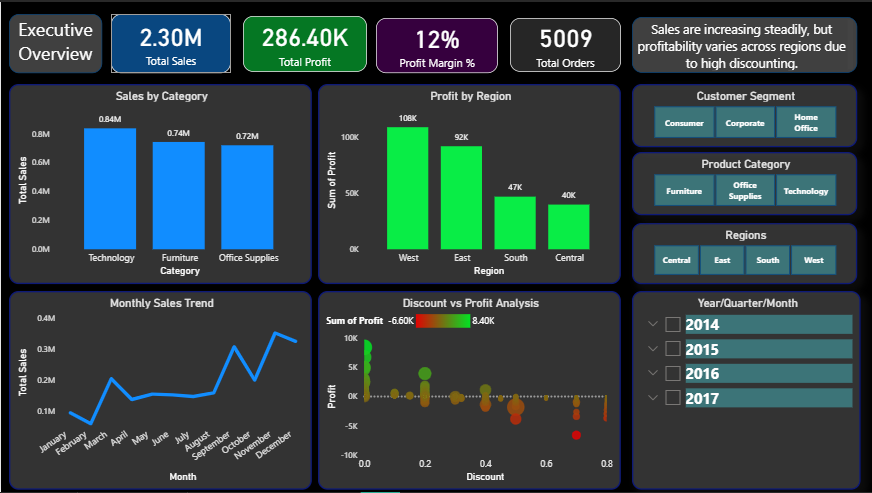
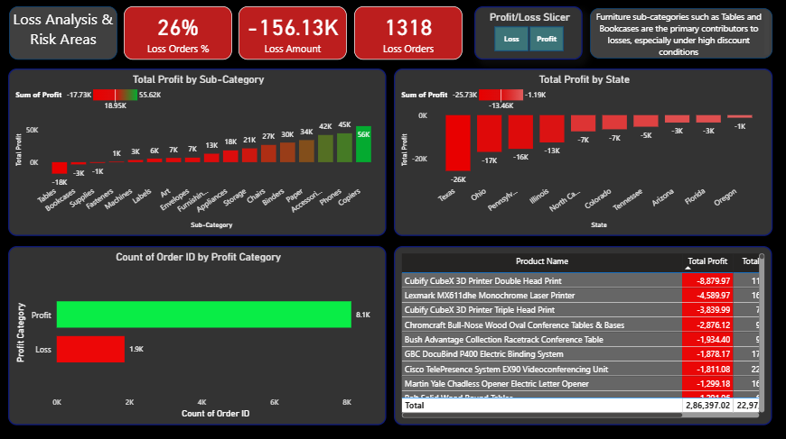
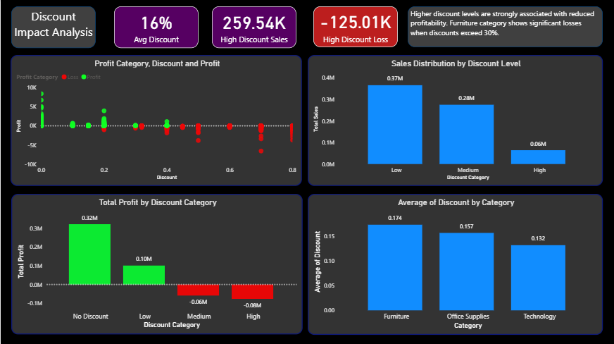

# Retail-Sales-Analytics-PowerBI
📊 Power BI dashboard analyzing retail sales & profitability, uncovering discount-driven losses and business inefficiencies.
## 🔍 Overview
This project analyzes retail sales data to uncover key drivers of profitability and loss using Power BI.
Despite strong sales performance, businesses often struggle with hidden losses caused by discounting strategies and product-level inefficiencies.
This dashboard provides a data-driven approach to identify these issues and support better decision-making.

## 🎯 Problem Statement
The business faced the following challenges:
- High sales but inconsistent profitability
- Lack of visibility into loss-making products and regions
- Unclear impact of discount strategies on profit

## 🛠️ Solution Approach
### 🔹Data Preparation
- Cleaned and transformed ~10,000+ transaction records using Power Query
- Created derived features:
  - Profit Category (Profit/Loss)
  - Discount Category (Low/Medium/High)
  - Profit Margin & Delivery Days
 

### 🔹Data Modeling
- Designed a star schema:
  - Fact table → Transactions
  - Dimension tables → Product, Customer, Location, Date
- Created surrogate keys for proper relationships

### 🔹DAX & KPIs
Developed key business metrics:
- Total Sales, Total Profit, Total Orders
- Profit Margin %
- Loss Orders & Loss %
- Discount Impact Metrics

## 📊 Dashboard Pages
## 🟢 Executive Overview
Key Insights:
- Strong overall sales performance
- Profit varies significantly across regions
- Early indication of discount-driven inefficiencies



## 🔴 Loss Analysis & Risk Areas
Key Insights:
- Furniture category (Tables, Bookcases) drives majority of losses
- Specific states contribute disproportionately to negative profit
- 26% of total orders result in losses



## 🟠 Discount Impact Analysis
Key Insights:
- Discounts above 30% strongly correlate with losses
- High discounts increase sales but reduce profitability
- Furniture category is most affected by aggressive discounting



##

### 💡 Key Business Findings
- 📉 High discounting is the primary driver of losses
- 📦 Certain product categories consistently underperform
- 🌍 Regional performance varies significantly
- ⚖️ Sales growth does not guarantee profitability

### 🎯 Business Recommendations
- Optimize discount strategies (avoid >30% discounts)
- Focus on high-margin product categories
- Reduce losses in underperforming regions
- Implement profit-driven sales strategies

### 🧠 Skills Demonstrated
- Power BI (Dashboard Development & Visualization)
- Data Modeling (Star Schema)
- DAX (CALCULATE, DIVIDE, DISTINCTCOUNT)
- Data Cleaning (Power Query)
- Business Analysis & Insight Generation

### 📌 Tools Used
- Power BI
- Excel / CSV Dataset

### 🚀 Project Outcome
This dashboard enables stakeholders to:
- Identify loss-making areas quickly
- Understand impact of pricing strategies
- Make data-driven decisions to improve profitability

```
Retail-Sales-Analytics-PowerBI/
│
├── README.md
├── dataset/
│   └── superstore.csv
├── pbix/
│   └── superstore_dashboard.pbix
├── images/
│   ├── executive_overview.png
│   ├── loss_analysis.png
│   └── discount_impact.png
```
